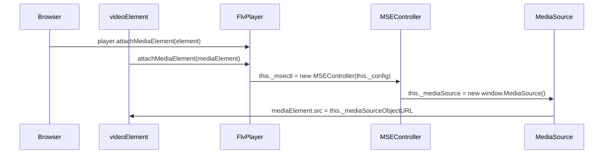
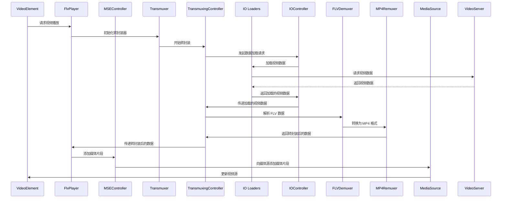
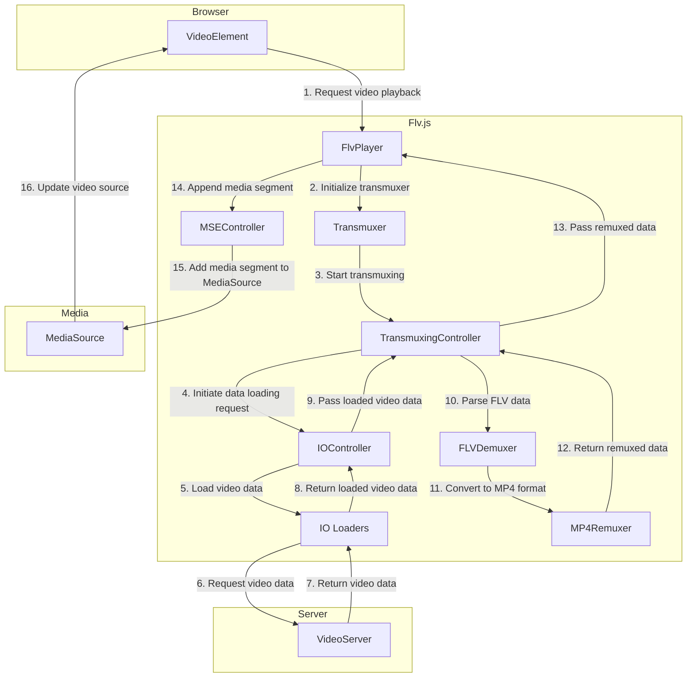

# How flv.js works

Welcome to the "how-flvjs-works" repository!🎉

This project provides a straightforward understanding of [flv.js](https://github.com/bilibili/flv.js), an HTML5 Flash Video (FLV) Player written in pure JavaScript without Flash. , using code analysis📝 and a simple online demo💻.

## Architecture

### Official Architecture Diagram

### Initialization Sequence Diagram

### Video loading Sequence Diagram

Another way to show the sequence diagram:

